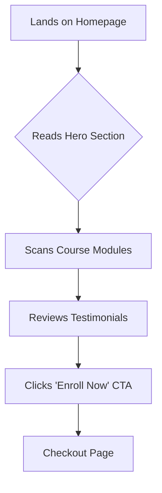
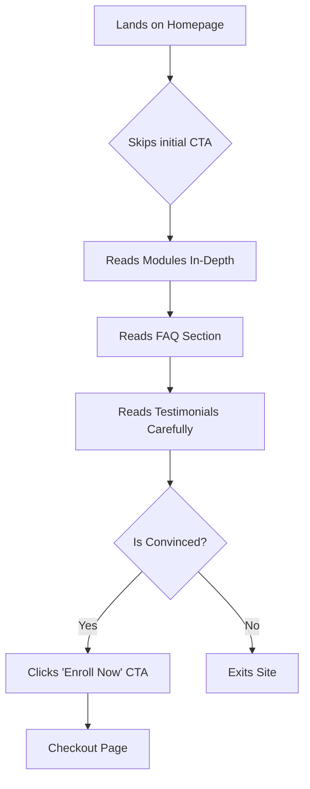

# User Flows

This document describes the key user journeys through the Spicy AI Content Creator Course website.

### Flow 1: The Convinced Buyer

This user has high intent and is likely coming from a referral or targeted ad.

1.  **Entry Point:** User lands on the homepage (`/`).
2.  **Hero Section:** The user is immediately greeted with a powerful headline like "Go Viral or Go Home. Master Spicy Content with AI.". They see the main CTA: "Enroll Now".
3.  **Scan Key Info:** The user quickly scrolls to confirm the course meets their needs. They scan the "What You'll Master" (modules) section and the price.
4.  **Social Proof:** They glance at the testimonials section, which reinforces their decision.
5.  **Conversion:** The user clicks one of the prominent "Enroll Now" buttons.
6.  **End Point (Simulated):** The user is directed to a payment/checkout page.

### Flow 2: The Skeptical Researcher

This user is interested but needs more information and convincing before making a decision.

1.  **Entry Point:** User lands on the homepage (`/`).
2.  **Information Gathering:** The user scrolls past the initial CTA to read the course module descriptions in detail.
3.  **Overcoming Objections:** The user is looking for reasons *not* to buy. They navigate to the FAQ section to find answers to their questions about refunds, prerequisites, and lifetime access.
4.  **Building Trust:** After having their questions answered, they read through the testimonials more carefully, looking for relatable success stories.
5.  **Re-engagement:** Convinced of the value, the user scrolls back up or finds a lower CTA and clicks "Enroll Now".
6.  **End Point (Simulated):** The user is directed to a payment/checkout page.

